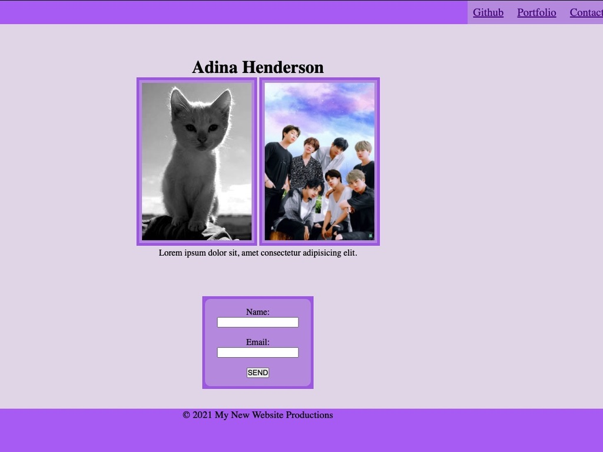

# mini-project1
Unit 01 Mini-Project: Landing Page
This exercise is to practice thecreation of a landing page:

- Gathering the visitor's contact info
- Header/footer
- Image/caption

[Webpage](https://adina-hc.github.io/mini-project-w1/)
